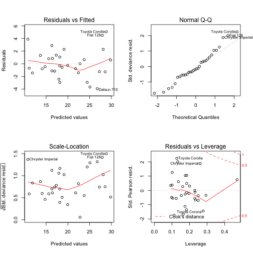

<style>
.small-code pre code {
  font-size: 0.9em;
}
</style>

MPG Predictor
========================================================
author: Armando Guereca
date: Nov 19, 2015

Introduction
========================================================

In 1974 Motor Trend a US magazine, performed road tests for 32 cars in the 1973-74 model year. They recorded 11 statistics about each model of car, the results are available on the data-set **mtcars** as part of R.

This application will help you estimate the expected change on MPG consumption of each of the 32 cars in the scenario that you alter the factory gross Horsepower or if the total Weight of the vehicle is changed by additional load that you might plan to carry on it.

Our MPG Predictor might prove useful to estimate your gasoline cost on your next family trip, giving you a quantitative argument to reduce the total luggage weight.


Usage
========================================================

To use this tool is as simple as 1,2,3…

- *Vehicle selection*

    Identify your vehicle (or the closest one) in the left list.
- *Experiment*

    Using the sliders you can select a new value for the total Weight (lb/1000).
- *Results*

    The resulting prediction is available on the first tab of the right panel.

Regression model used on our prediction
========================================================
class: small-code


```r
summary(fit)
```

```

Call:
glm(formula = mpg ~ cyl + hp + wt + am, family = "gaussian", 
    data = cars_data)

Deviance Residuals: 
    Min       1Q   Median       3Q      Max  
-3.9387  -1.2560  -0.4013   1.1253   5.0513  

Coefficients:
            Estimate Std. Error t value Pr(>|t|)    
(Intercept) 33.70832    2.60489  12.940 7.73e-13 ***
cyl6        -3.03134    1.40728  -2.154  0.04068 *  
cyl8        -2.16368    2.28425  -0.947  0.35225    
hp          -0.03211    0.01369  -2.345  0.02693 *  
wt          -2.49683    0.88559  -2.819  0.00908 ** 
ammanual     1.80921    1.39630   1.296  0.20646    
---
Signif. codes:  0 '***' 0.001 '**' 0.01 '*' 0.05 '.' 0.1 ' ' 1

(Dispersion parameter for gaussian family taken to be 5.808677)

    Null deviance: 1126.05  on 31  degrees of freedom
Residual deviance:  151.03  on 26  degrees of freedom
AIC: 154.47

Number of Fisher Scoring iterations: 2
```

Quick look into our model's residuals
========================================================


